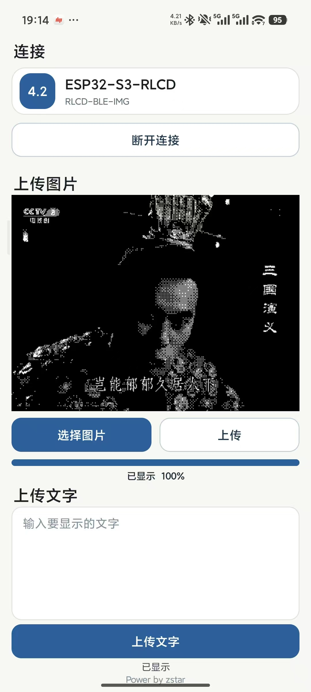
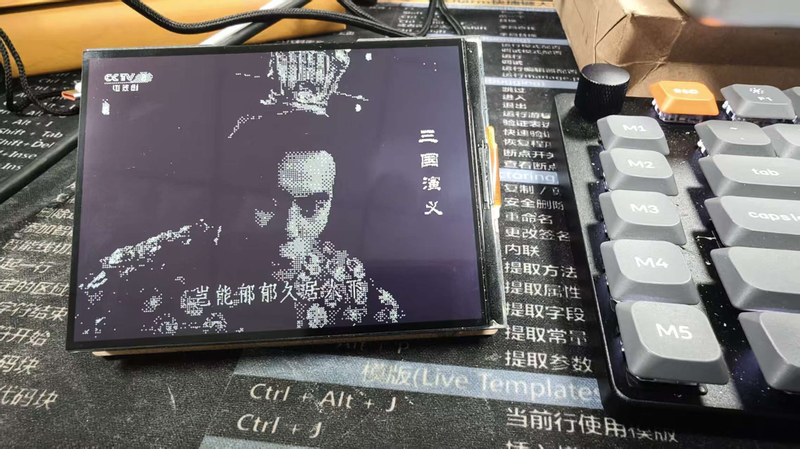
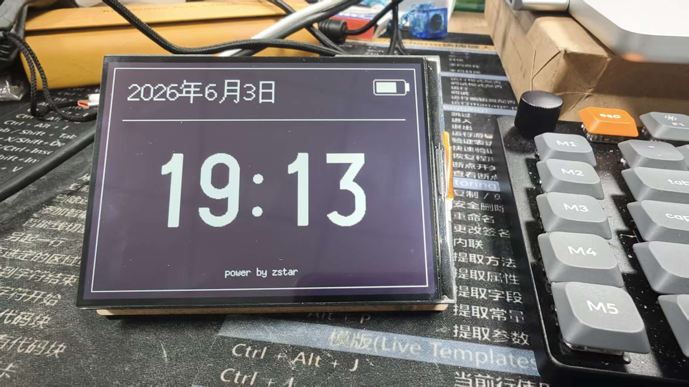

<div align="center">
  
</div>

<div align="center">
  <h4>
    <a href="README.md">🇨🇳 中文</a>
    <span> | </span>
    <a href="README_EN.md">🇬🇧 English</a>
  </h4>
</div>

这是一个基于 Waveshare ESP32-S3-RLCD-4.2 开发板二次开发的项目。它可以在 Android App 蓝牙把图片或文字发送到开发板并显示在墨水屏上。

## 效果展示

App 端连接开发板并上传图片。

<div align="center">
  
</div>

开发板侧显示图片。

<div align="center">
  
</div>

开发板上有三个按键，从左到右依次为 KEY、POWER 和 BOOT。

- 短按 `KEY`：切换到图片页。
- 短按 `BOOT`：切换到文字页。
- 长按 `KEY` 或 `BOOT`：切换到默认时钟页。

默认时钟页：

<div align="center">
  
</div>

## 硬件

- Waveshare ESP32-S3-RLCD-4.2
- 用于烧录的 USB-C 数据线
- 可选 18650 锂电池，用于脱离电脑供电
- 支持 BLE 的 Android 手机

电源键由开发板硬件控制。固件只在开发板开机后读取 `KEY` 和 `BOOT` 按键。

## 固件烧录

需要安装：

- Arduino IDE 2.x 或 `arduino-cli`
- ESP32 Arduino core
- U8g2 库

Arduino IDE 推荐配置：

| 配置项 | 值 |
| --- | --- |
| Board | ESP32S3 Dev Module |
| USB CDC On Boot | Enabled |
| USB Mode | Hardware CDC and JTAG |
| Flash Size | 16MB |
| Partition Scheme | 3M app / 9M FATFS |
| PSRAM | OPI PSRAM |
| Flash Mode | QIO |
| CPU Frequency | 240MHz |
| Upload Speed | 921600 |

使用 `arduino-cli` 编译：

```bash
arduino-cli core install esp32:esp32
arduino-cli lib install U8g2
arduino-cli compile \
  --fqbn 'esp32:esp32:esp32s3:USBMode=hwcdc,CDCOnBoot=cdc,UploadMode=default,FlashSize=16M,PartitionScheme=app3M_fat9M_16MB,PSRAM=opi,FlashMode=qio,CPUFreq=240,UploadSpeed=921600' \
  firmware
```

上传固件：

```bash
arduino-cli upload \
  -p /dev/tty.usbmodemXXXX \
  --fqbn 'esp32:esp32:esp32s3:USBMode=hwcdc,CDCOnBoot=cdc,UploadMode=default,FlashSize=16M,PartitionScheme=app3M_fat9M_16MB,PSRAM=opi,FlashMode=qio,CPUFreq=240,UploadSpeed=921600' \
  firmware
```

如果开发板没有自动进入下载模式，先拔掉 USB-C，按住 `BOOT`，重新插入 USB-C，等待约 1 秒后松开 `BOOT`，再重新上传。

## Android 打包

Android App 没有使用 Gradle，直接通过 Android SDK 命令行工具构建。

需要：

- Android SDK Platform 35
- Android Build Tools 35.0.0
- 带有 `javac` 和 `keytool` 的 JDK
- `openssl`

构建 debug APK：

```bash
cd android
./build_apk.sh debug
```

构建签名 release APK：

```bash
cd android
./build_apk.sh release
```

输出路径：

- Debug：`android/app/build/outputs/apk/debug/rlcd-ble-image-debug.apk`
- Release：`android/app/build/outputs/apk/release/momo-release.apk`

第一次构建 release 时会生成 `release.keystore` 和 `release-signing.properties`，它们不会被 Git 跟踪。后续如果希望 release APK 能覆盖升级同一个已安装 App，需要保留这两个文件。

## 使用方法

1. 将 `firmware` 烧录到 ESP32-S3-RLCD-4.2 开发板。
2. 安装 Android APK。
3. 给开发板上电。
4. 打开手机上的 `墨墨`，允许蓝牙权限。
5. 点击连接按钮。App 只扫描 `RLCD-BLE-IMG` 并自动连接。
6. 选择图片或输入文字，然后上传到开发板。

App 连接开发板后会自动同步手机时间，默认时钟页会使用同步后的时间刷新。

## 开源协议

本项目使用 [Apache License 2.0](./LICENSE)。
